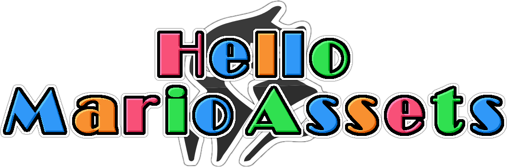

> **Due to this project's large file size when uncompressed (1GB), you need to download the Unity package file from the [releases page](https://github.com/HelloFangaming/HelloMarioAssets/releases) instead of pulling from the repository.**

# Overview

Hello Mario Assets is a collection of hundreds of 3D models and thousands of animations for Unity that you can use to jump start your very own 3D Mario fangame!

A question that people who want to start their own 3D Mario project have is this: Where do I even begin? Websites like The Models Resource don't have all the models you'll need to make a full game, and they don't provide any animations either. Hello Mario Assets is designed to solve this problem by giving you a starting point that you can build on.

Ripped, converted, and imported to Unity by Hello Fangaming.

All models were ripped from various Nintendo games. Mainly Super Mario 3D World.

Designed for Unity 2019.4 and above. Old versions may or may not work.

# Notes
* Some models, like pipes for example, have alternate colors. Check the Mat folder, and drag and drop them on the model to use.
* Many characters and enemies have different facial expressions, hands, powerups, and other parts as seperate GameObjects you can enable and disable.
* Sign board arrows are seperate GameObjects you can enable and disable.
* The materials in the Materials folder can be used on your level geometry.

# Tools
* [Switch Toolbox](https://github.com/KillzXGaming/Switch-Toolbox)
* [Noesis](https://www.richwhitehouse.com/index.php?content=inc_projects.php&showproject=91) (For file conversions)
* [Random Talking Bush's Scripts](https://www.vg-resource.com/thread-29836.html)
